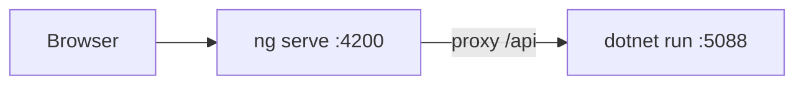
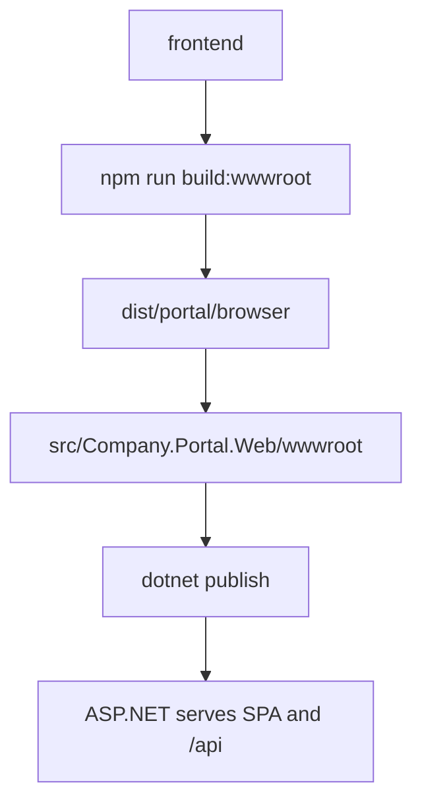
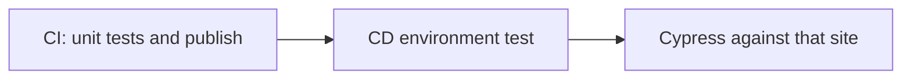

# Angular build process

`frontend/` is an Angular 22 workspace (latest stable at the time it was added). Node must be `^22.22.3`, `^24.15.0`, or newer (`frontend/.nvmrc` selects 24). The invoices page, service, models, and auth interceptor live under `frontend/src/app`.

## Local

Run the BFF, then the Angular dev server. `proxy.conf.json` forwards `/api` to `http://localhost:5088`.



```text
dotnet run --project src/Company.Portal.Web
cd frontend && npm ci && npm start
```

Open the URL `ng serve` prints (default http://localhost:4200).

## Production flow



```text
cd frontend
npm ci
npm run build:wwwroot
dotnet publish src/Company.Portal.Web
```

`build:wwwroot` runs `ng build` and copies `dist/portal/browser/` onto `src/Company.Portal.Web/wwwroot/`.

Runtime: ASP.NET serves the SPA from `wwwroot`. API calls stay same-origin (`/api/me/invoices-page`).

## What `ng build` does

1. Read `angular.json` build target (`@angular/build:application` on new apps, esbuild).
2. Compile templates + TypeScript.
3. Bundle, tree-shake, code-split lazy routes.
4. Minify and hash filenames in production.
5. Emit `index.html` plus JS/CSS/assets.

`ng serve` is for local reload only. Do not deploy it.

## CI and CD

`azure-pipelines.yml` is the Azure DevOps pipeline.



CI runs on every push and pull request to `main`: `dotnet test`, `npm test`, `build:wwwroot`, then `dotnet publish`.

CD runs on `main` after CI. It deploys that published build to the Azure DevOps environment `test` and starts it on the agent. Cypress then opens that site. It does not run against `ng serve`. The test host uses the Development auth scheme so the demo subject `user-1` can load invoices before a real identity provider is configured.
