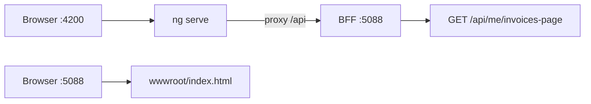
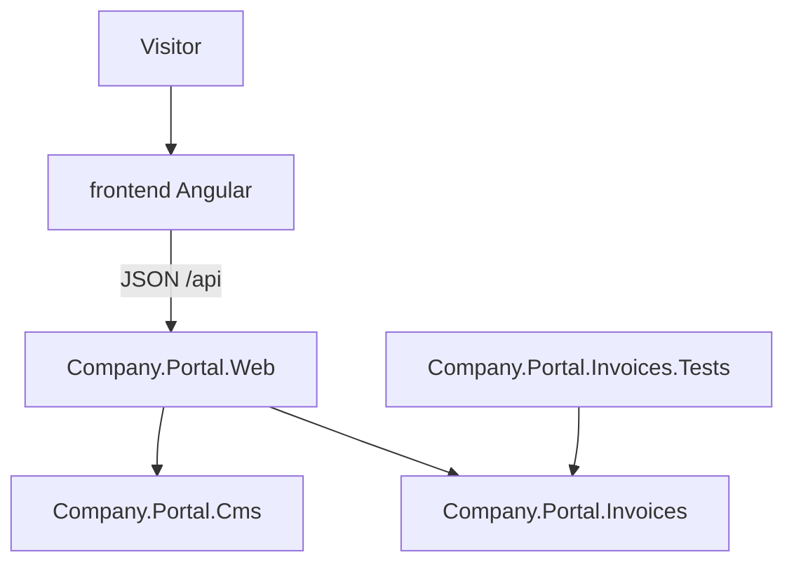
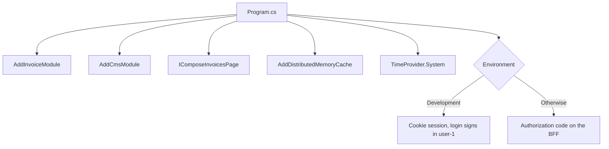
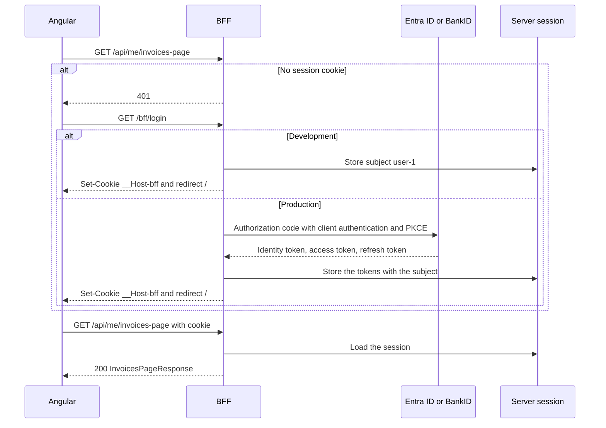
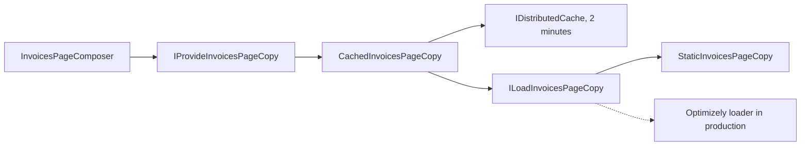
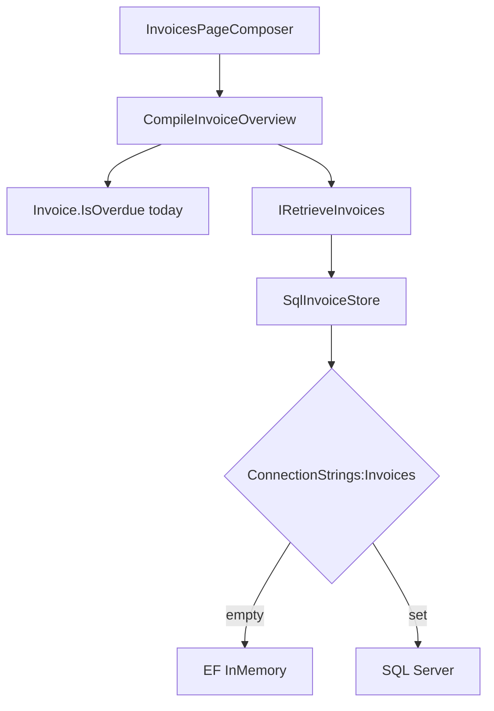
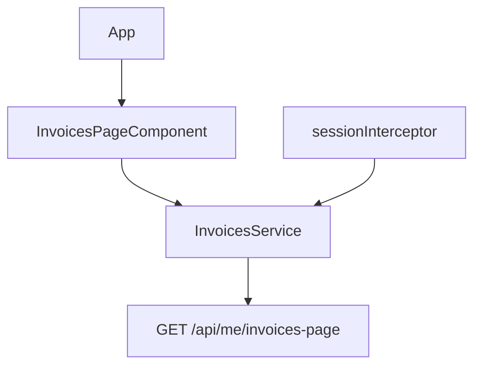
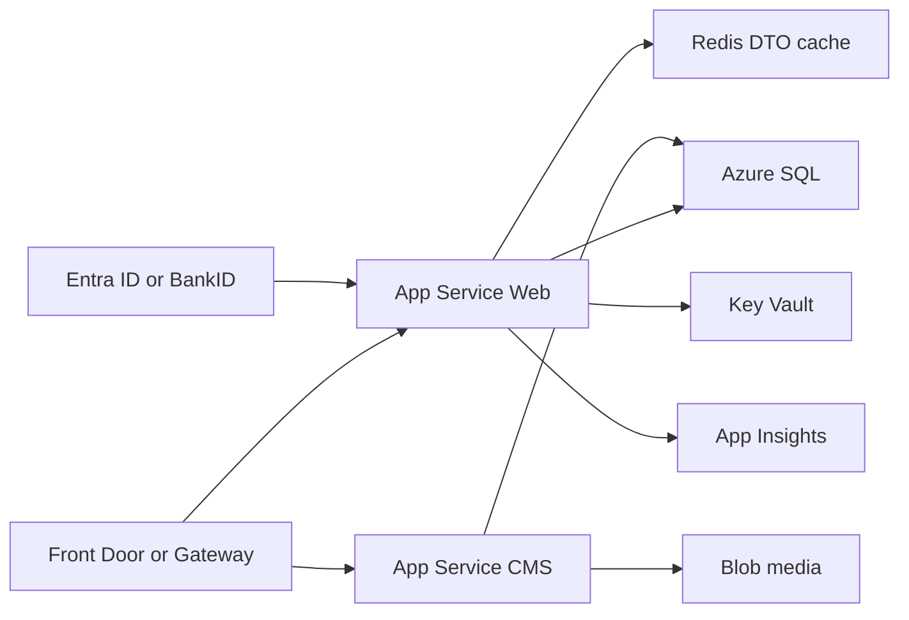

# Architecture

## Decision

A **full onion around the whole site does not fit**. Optimizely content types inherit `PageData`. Putting those in a domain core is cargo-cult layering.

Use:

- Modular monolith on one (or two) deployables
- CMS as an adapter that emits DTOs
- Clean / hexagonal **only** in business modules (invoices, profile, XML integrations)
- BFF in the web host that aggregates CMS chrome + business data
- Angular as its own app

The host is the only project that knows both modules. Invoices never reference CMS types. CMS never references invoices. Angular never references C# types. The shared thing is the JSON body of `GET /api/me/invoices-page`.

## Two processes while developing

`npm start` serves the Angular app at http://localhost:4200. `frontend/proxy.conf.json` forwards `/api` and `/bff` to http://localhost:5088, so the page, the session, and the API look same-origin to the browser.

http://localhost:5088 is the BFF. `UseDefaultFiles`, `UseStaticFiles`, and `MapFallbackToFile("index.html")` serve `src/Company.Portal.Web/wwwroot/index.html` for `/`. That file is a static stand-in. It is not the Angular app. `npm run build:wwwroot` deletes `wwwroot` and copies the Angular production build there, which is how one host serves both the page and the API after publish.

## Projects

| Project | Wired as | Why |
|---|---|---|
| `frontend/` | Calls `/api/me/invoices-page` and renders the JSON | The visitor UI is Angular. It stays a separate app so a CMS upgrade does not rebuild domain rules |
| `Company.Portal.Web` | Composition root, controller, composer, auth, static files | Something must join CMS copy and invoices into one response. That join is a page concern, so it lives in the host |
| `Company.Portal.Cms` | `IProvideInvoicesPageCopy` | Editor text is an adapter. The host asks for a DTO and does not see `PageData` |
| `Company.Portal.Invoices` | `ICompileInvoiceOverview` | Overdue rules and the invoice store are business behavior. They stay in the feature assembly |
| `Company.Portal.Invoices.Tests` | xUnit against the invoices assembly | Domain rules are tested without the host or the CMS |

## Composition root

`Program.cs` is the only place that registers both modules.

`AddInvoiceModule` reads `ConnectionStrings:Invoices`. An empty string selects EF InMemory (`portal-invoices`). A SQL string selects SQL Server. The use case does not know which one it got.

`AddCmsModule` registers `StaticInvoicesPageCopy` as `ILoadInvoicesPageCopy` and `CachedInvoicesPageCopy` as `IProvideInvoicesPageCopy`. The cache decorator is what the host calls. The loader is an internal detail the host can swap for Optimizely later.

`TimeProvider.System` is registered once. Overdue checks and the 365-day invoice window both read that clock, so tests can move "today" without calling `DateTime.UtcNow`.

On startup the host seeds `DemoInvoiceCatalog` when the invoice table is empty. The demo rows belong to subject `user-1`, which is also the development default.

Pipeline order: HTTPS redirect, cross-origin rejection, default files, static files, authentication, authorization, controllers, then the `index.html` fallback. API routes win over the fallback. Any other path returns the static page so a published Angular route still loads the SPA shell. `/api` and `/bff/logout` reject a `cross-site` fetch. The SPA and the BFF stay on one site, which is what lets the session cookie use `SameSite=Strict`.

## One request

`GET /api/me/invoices-page`

- Session: `__Host-bff` cookie. A missing session is 401, and the SPA navigates to `/bff/login`
- Development login signs in `user-1`, or the subject in `X-User-Sub` on that login request
- Language: `Accept-Language` (`en` prefix → English, else Swedish)
- 404 if CMS copy missing

The controller is thin on purpose. It reads `sub` (or the name identifier), picks `en` or `sv`, and maps a null page to 404. It does not know about cache keys, EF, or overdue rules.

`InvoicesPageComposer` starts both reads and waits with `Task.WhenAll`. Copy and invoices do not depend on each other. A missing copy is a missing page, so the composer returns null and drops the invoice list. An empty invoice list is still a page.

`InvoicesPageResponse` is the JSON contract: `heading`, `introductionHtml`, `helpHtml`, and `invoices`. The Angular `InvoicesPage` interface repeats that shape. The two types are not shared, so the frontend build does not reference the .NET projects.

## Session

The BFF is the OAuth confidential client. The Angular app is not. Tokens stay in the server session. The browser only receives a session cookie.

`__Host-bff` is `Secure`, `HttpOnly`, and `SameSite=Strict`, with `Path=/` and no `Domain`. Script cannot read it. A cross-site page cannot attach it. The cookie value is a session key. `DistributedCacheTicketStore` keeps the authentication ticket, including any tokens, in `IDistributedCache` and protects that payload with data protection. This repo uses the memory cache. A second instance needs Redis behind the same interface, and that cache must stay private because the ticket can hold tokens.

Development login does not call an identity provider. `GET /bff/login` stores `user-1`, or `X-User-Sub` when that header is present on the login request, and redirects to a local path. `POST /bff/logout` removes the server ticket.

Production login challenges OpenID Connect. The BFF exchanges the code with `Auth:ClientId` and `Auth:ClientSecret`, uses PKCE, and keeps `MapInboundClaims` false so `sub` stays `sub`. `SaveTokens` puts the tokens in the server ticket. The invoices module still authorizes with that `sub`. This slice does not forward the access token to another API, because the invoice read runs in-process. A later downstream call would attach the token from the session, not from the browser.

Access tokens should stay short-lived. Refresh tokens, when the identity provider issues them, should not outlive the eight-hour session. Client authentication with a private key (mTLS or a JWT bearer client assertion) and sender-constrained access tokens (`cnf` / `x5t#S256`) are the next hardening step when Entra ID or the BankID broker supports them. This repo does not terminate mTLS.

The Angular `sessionInterceptor` does not add an `Authorization` header and does not read storage. On 401 it navigates to `/bff/login`. The browser attaches the cookie by itself.

## CMS adapter

`IProvideInvoicesPageCopy` is the port the host is allowed to see. `ILoadInvoicesPageCopy` is internal. Callers cache the DTO, not a CMS page object, so a later Optimizely implementation can change without changing the composer.

`CachedInvoicesPageCopy` stores JSON under `cms:invoices-page:{language}` for two minutes. This repo registers `AddDistributedMemoryCache`, which is process-local. A second instance needs Redis behind the same `IDistributedCache` interface. The loader is not called again until the entry expires or is missing.

`StaticInvoicesPageCopy` returns Swedish copy unless the language is `en`. It exists so the solution compiles and runs without Optimizely packages. Production replaces that registration with a loader that maps a published page to `InvoicesPageCopy`.

## Invoice module

`IRetrieveInvoices` is a role, not an `IInvoiceRepository`. `SqlInvoiceStore` loads rows for the subject whose due date is inside the last 365 days, then maps each `InvoiceRecord` to an `Invoice`. The record is the EF shape. The `Invoice` is the behavior.

`Invoice.IsOverdue` is true when the status is open and the due date is before today. A paid invoice must have a payment timestamp. Those rules sit in the domain type so the controller cannot reimplement them.

`CompileInvoiceOverview` sorts by due date and maps each invoice to `InvoiceOverviewItem` (`id`, `amount`, `currency`, `dueDate`, `status`, `isOverdue`). That record is the list item in the JSON. The Angular template binds those fields and does not recalculate overdue.

## Angular page

`App` only hosts `InvoicesPageComponent`. The component turns the HTTP call into a `view` signal with `loading`, `error`, and `ok`. `InvoicesService` is the only HTTP caller. `sessionInterceptor` sends the browser to `/bff/login` on 401. The template and styles live beside the class (`invoices-page.component.html` and `.css`). CMS HTML fields are bound with `[innerHTML]` because the editor owns that markup.

## Production Azure (not referenced so the repo compiles)

| Swap | From | To | Why |
|---|---|---|---|
| Page copy | `StaticInvoicesPageCopy` | Optimizely `ILoadInvoicesPageCopy` | Editors publish the texts. The cache still stores the DTO |
| Invoice store | EF InMemory | Azure SQL via `ConnectionStrings:Invoices` | InMemory is the empty-connection default so the repo runs with no database |
| Cache | Memory | Azure Cache for Redis | Memory cache is not shared across instances |
| Auth | Development cookie login | Authorization code on the BFF | The BFF is the confidential client. The browser keeps `__Host-bff`, not tokens |
| UI host | `ng serve` on 4200 | `wwwroot` inside the Web app | One App Service serves the built SPA and the API |

CMS on its own App Service is optional. Front Door or Gateway is the edge. Key Vault holds secrets. App Insights is telemetry. Blob storage is for CMS media. None of those packages are referenced here, so the solution still builds offline.

## Folder rule

Projects follow features and deployables (`Invoices`, `Cms`, `Web`), not layer names.
