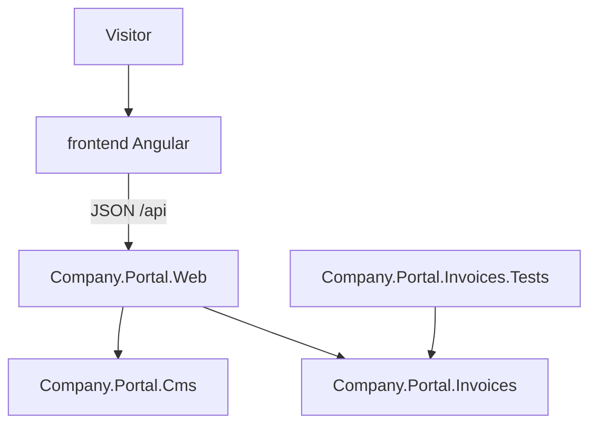
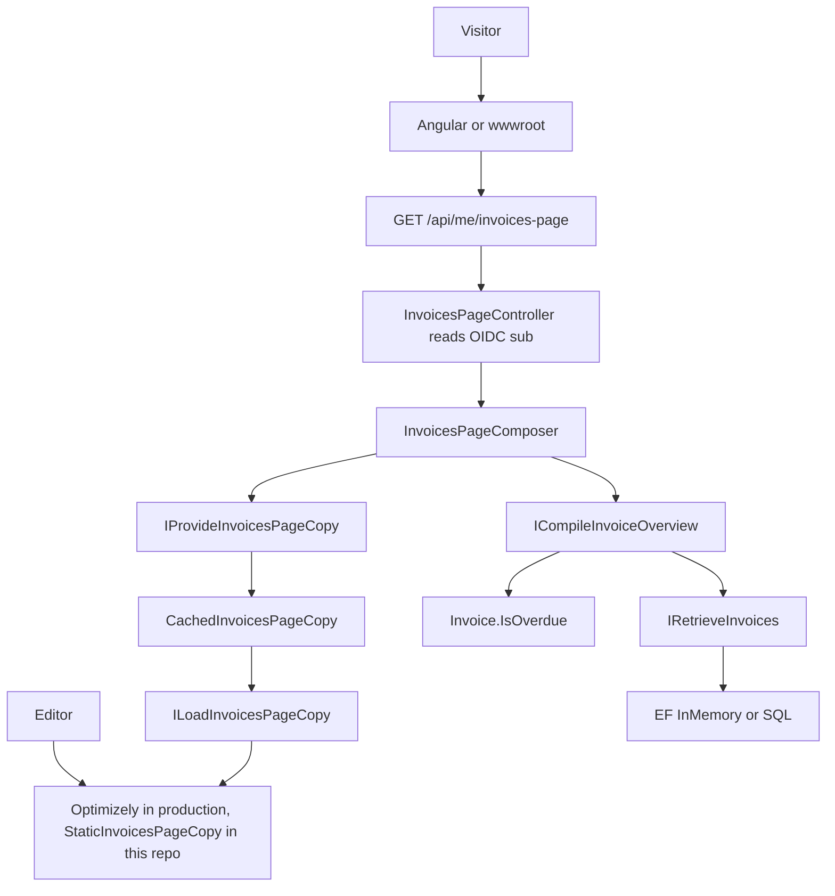
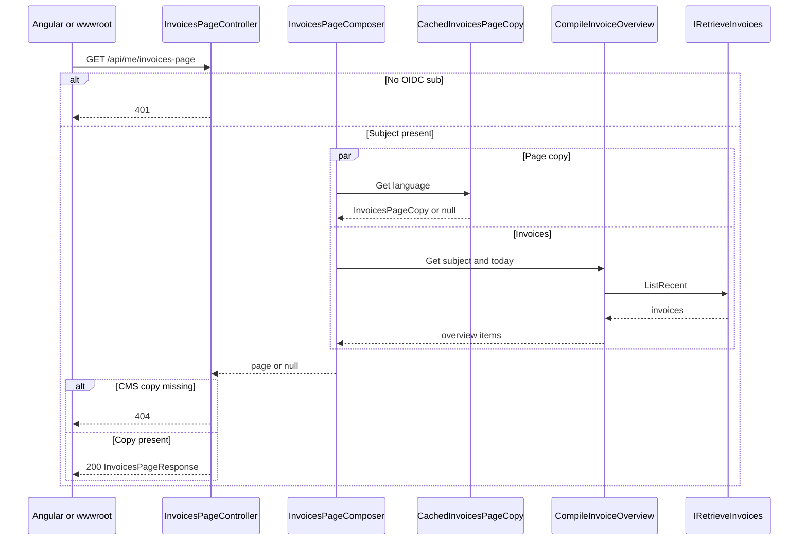
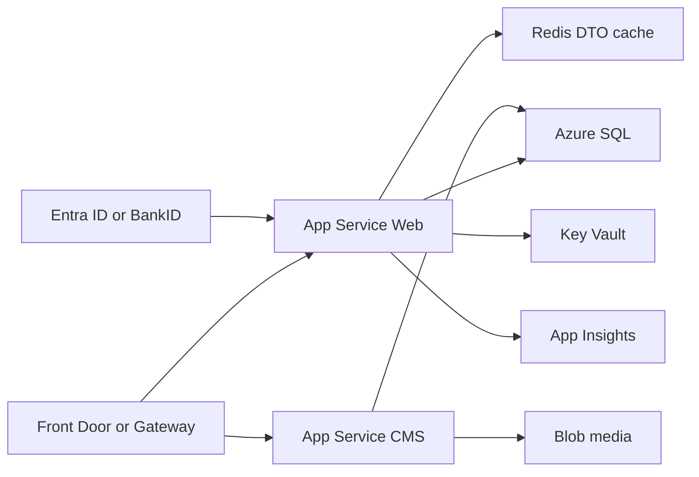

# Architecture

## Decision

A **full onion around the whole site does not fit**. Optimizely content types inherit `PageData`. Putting those in a domain core is cargo-cult layering.

Use:

- Modular monolith on one (or two) deployables
- CMS as an adapter that emits DTOs
- Clean / hexagonal **only** in business modules (invoices, profile, XML integrations)
- BFF in the web host that aggregates CMS chrome + business data
- Angular as its own app

## Projects

`Company.Portal.Web` is the composition root. It owns the BFF, auth, and static host. CMS and invoices stay feature assemblies. The Angular app shares the JSON contract, not C# types.

## Runtime map

## Request example

`GET /api/me/invoices-page`

- Dev identity: header `X-User-Sub` or default `user-1`
- Language: `Accept-Language` (`en` prefix → English, else Swedish)
- 401 if no subject, 404 if CMS copy missing

## Production Azure (not referenced so the repo compiles)

CMS on its own App Service is optional. This repo keeps the static copy loader so it compiles without Optimizely packages.

## Folder rule

Projects follow features and deployables (`Invoices`, `Cms`, `Web`), not layer names.
