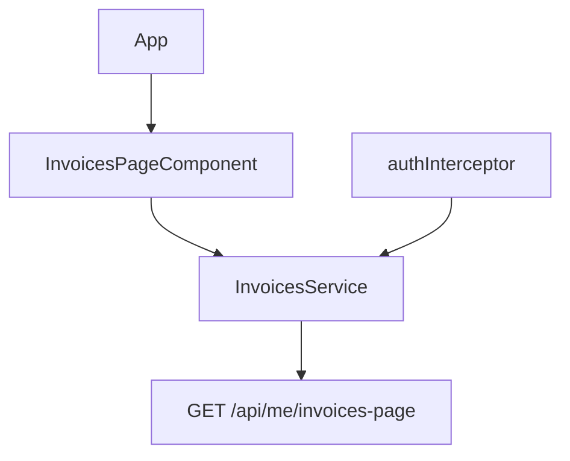

# Frontend code standards

Conventions for the Angular app in `frontend/`. C# rules live in [coding-standards.md](coding-standards.md). How the page is composed lives in [architecture.md](architecture.md).

**Authority (first match wins):**

1. [angular.dev](https://angular.dev) and the [Angular Style Guide](https://angular.dev/style-guide)
2. **This file** — what this repo enforces
3. The JSON contract of `GET /api/me/invoices-page` — share that shape, not C# types

## App

One standalone Angular 22 app. It renders **Mina fakturor** and calls the BFF over JSON.



`App` only hosts the invoices page. `InvoicesService` is the only HTTP caller. The interceptor attaches a bearer token when one is stored. The page does not talk to SQL, Optimizely, or Redis.

## Layout

| Path | Owns |
|---|---|
| `src/app/invoices/` | Page, service, and `invoices.models.ts` |
| `src/app/core/` | HTTP interceptor |
| `src/main.ts` | `bootstrapApplication` |

- Feature folders, not top-level `components/` and `services/` buckets
- Hyphenated file names matching the type: `invoices-page.component.ts` ↔ `InvoicesPageComponent`
- Co-locate `.ts`, template, styles, and `*.spec.ts`
- One primary concept per file
- DTOs for the page response live in `invoices.models.ts`. Components and services import them

## TypeScript

Keep the compiler strictness already in `frontend/tsconfig.json` (`strictInjectionParameters`, `strictInputAccessModifiers`). Do not turn checks off to unblock a screen.

| Do | Do not |
|---|---|
| Interfaces for the invoices page body | `any`, or a cast to silence the contract |
| `unknown` and a narrow in `catch` | Empty `catch` or `catch (e: any)` |
| `@ts-expect-error` only with a short reason | `@ts-ignore` to ship |

## Components and data

- Standalone components. Do not add NgModules for features
- Prefer [`inject()`](https://angular.dev/style-guide#prefer-the-inject-function-over-constructor-parameter-injection) over constructor injection
- `protected` for members only the template reads
- Prefer `input()` / `output()` when a presentational piece is extracted. That piece does not call HTTP
- View state is a signal (`toSignal` on the page request is the current shape). Do not add NgRx or a global store for this one screen
- Angular 22 checks components when a signal, input, or template event changes. Do not set `ChangeDetectionStrategy.Eager` to paper over a stale binding
- Provide `HttpClient` with `provideHttpClient(withInterceptors([authInterceptor]))`
- Do not subscribe or start HTTP in a constructor. Long-lived subscriptions use `takeUntilDestroyed`
- Bind fields and message text. Do not call formatters from the template for every row
- Name handlers for the action (`reloadPage()`), not the DOM event (`handleClick()`)

```typescript
private readonly invoices: InvoicesService = inject(InvoicesService);
```

## API and auth

- Call same-origin `/api/me/invoices-page`. The dev server proxies that path to `http://localhost:5088`
- Dev identity is the BFF header `X-User-Sub` (default `user-1`). Production is JWT Bearer (`Auth:Authority`, `Auth:Audience`)
- The interceptor reads `sessionStorage` `access_token` and sets `Authorization` when a token exists. Do not scatter `sessionStorage.getItem` through features
- Authorization comes from the BFF identity (`sub`), not from a subject the page puts in the body
- `heading`, `introductionHtml`, and `helpHtml` are CMS copy. Bind those HTML fields with `[innerHTML]`. Do not bind visitor-typed strings that way

## Copy

Identifiers are US English. Visitor-facing strings may be Swedish. Editor texts come from the page-copy API, not from a second copy of the same heading in the template.

## Tests

`ng test` (Vitest). One concept per test. Assert the loading, error, and invoice states the page actually renders.

## Boundaries

- Keep browser calls on the BFF. SQL, Optimizely, and Redis stay on the server
- Keep page styles in the component. A UI kit needs a product reason
- Put JSON models in `frontend/`, and keep Optimizely `PageData` and C# types on the server
- Use the fields `InvoicesPage` already returns before adding a BFF route
