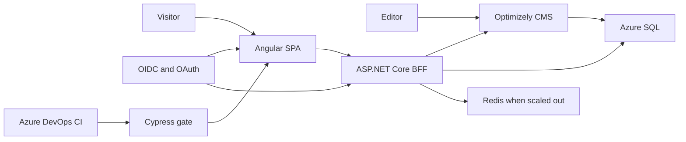

## Required

- Expert C#, JavaScript, TypeScript, .NET, CSS
- Expert Angular
- Azure DevOps including Continuous Integration
- Azure cloud solutions
- REST, JSON, XML
- Tailwind, Bootstrap, or equivalent CSS framework
- CMS, preferably EpiServer / Optimizely
- OAuth, OpenID Connect ("Open Identity"), Visual Studio, Postman
- Agile methods and TDD
- Automated tests including Cypress
- Test code and ensure quality before release
- Very good Swedish, spoken and written
- Proactive work style, security mindset, collaboration

## Meriting

- Docker
- SQL and databases
- Distributed cache such as Redis
- Web analytics: Google Analytics or Piwik PRO

## Inferred wiring

Docker is meriting only, so the host is App Service rather than AKS.
