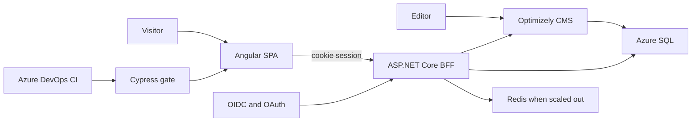

## Technical Required

- Expert C#, JavaScript, TypeScript, .NET, CSS
- Expert Angular
- Azure DevOps including Continuous Integration
- Azure cloud solutions
- REST, JSON, XML
- Tailwind, Bootstrap, or equivalent CSS framework
- CMS, preferably EpiServer / Optimizely
- OAuth, OpenID Connect ("Open Identity"), Visual Studio, Postman
- Agile methods and TDD
- Automated tests including Cypress
- Test code and ensure quality before release

## Meriting

- Docker
- SQL and databases
- Distributed cache such as Redis
- Web analytics: Google Analytics or Piwik PRO

## Inferred wiring

Required skills are the boxes on the diagram. SQL and Redis are meriting, and they appear only for invoices, CMS content, and a second instance. The host is App Service. Web analytics is meriting and has no box.

| Piece | What it does | Why it is here |
|---|---|---|
| Editor → Optimizely CMS | Editors publish the page texts | A CMS is required, and Optimizely is the preferred product |
| Visitor → Angular SPA | The logged-in UI | Angular is a required expert skill, so the visitor app is its own client |
| SPA → ASP.NET Core BFF | One REST JSON call returns CMS chrome and invoices | C# / .NET, REST, and JSON are required. The BFF is the aggregator for that response |
| OIDC and OAuth | The BFF runs the authorization-code flow and keeps the tokens in a server session | The SPA is a public client and cannot protect tokens. The BFF is the confidential client |
| BFF → CMS | Reads editor texts as DTOs | The CMS is an adapter. Optimizely types stay out of the invoice module |
| BFF and CMS → Azure SQL | Stores invoices and CMS content | Azure is required. SQL is meriting, and both Optimizely and invoices need a database |
| BFF → Redis | Caches CMS DTOs when more than one instance serves the site | A distributed cache is meriting, so Redis is the scale-out path |
| Azure DevOps CI → Cypress → SPA | The pipeline builds, then Cypress checks the UI before release | CI and Cypress are required, and the gate hits the visitor app |
| Host | Azure App Service runs the BFF and, if split, the CMS | Docker is meriting only, so the host is App Service |

Tailwind, Bootstrap, or an equivalent styles the SPA. It is not a separate service. XML stays in the .NET invoice integrations, because the page contract is JSON. Visual Studio and Postman are how the API is built and called. TDD covers the .NET modules and the Angular app. Cypress is the check before release.
